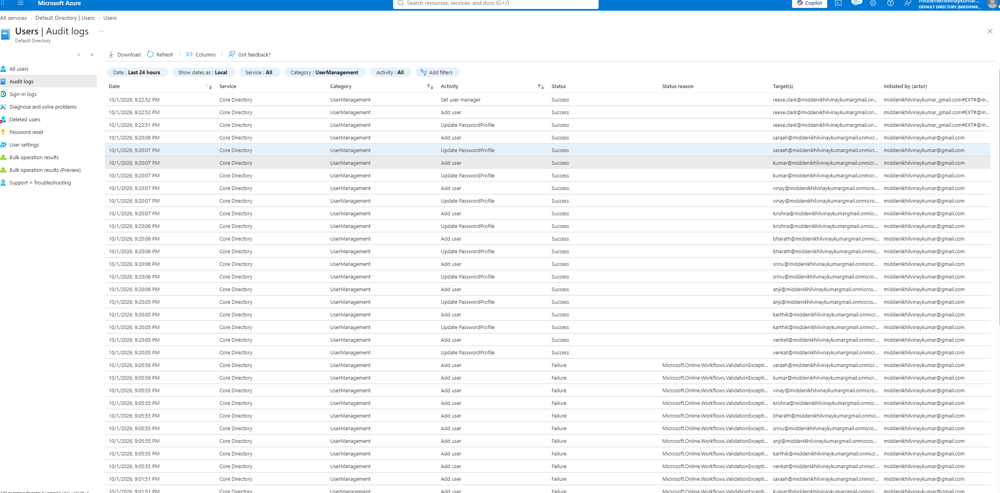
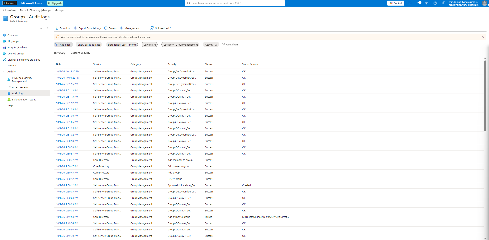

# VDR Directory Foundation

## Project Overview

This lab documents a practice Microsoft Entra ID directory for the fictional company VDR.

## Audit Evidence

### User changes

The log records the activity, timestamp, target account, status, and initiating administrator. Earlier bulk creation attempts failed because the initial passwords contained usernames. After correcting the passwords, the user creation events succeeded.

### Group changes

Successful Core Directory events include Add group, Add owner to group, and Add member to group. The screenshot also contains an earlier owner-assignment failure and a group deletion event, preserving the visible audit history.
